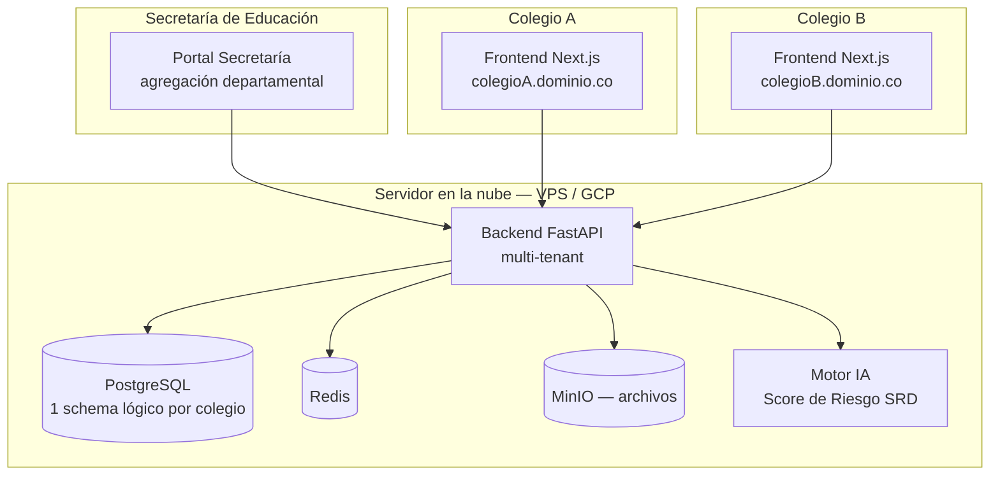
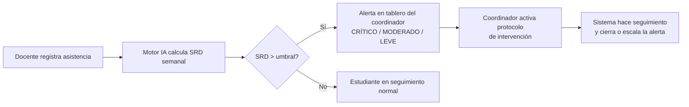

# GyverLabs — Sistema Educativo Inteligente

**Concurso Datos al Ecosistema 2026: IA para Colombia — Ministerio TIC**
Reto: *Innovación y Tecnología — Diseñar asistentes virtuales que faciliten el acceso ciudadano a datos abiertos*

**Autor / Desarrollador:** David Barrera (Juan David Quesada Barrera) — CEO y desarrollador, GyverLabs — San Pablo, Sur de Bolívar, Colombia
**Co-equipera:** Katy Álvarez — Administradora de Empresas, GyverLabs
**Estado:** Repositorio de evaluación para el jurado del concurso. Ver [`LICENSE`](./LICENSE) antes de usar, copiar o distribuir cualquier parte de este código.

---

## 1. Resumen ejecutivo

GyverLabs es una plataforma **SaaS multi-tenant** de transformación digital para instituciones educativas públicas colombianas. Un solo servidor en la nube sirve a *N* colegios independientes, cada uno con su propio dominio, base de datos lógicamente aislada, identidad visual y usuarios.

La plataforma integra cuatro módulos que atacan los problemas más críticos del sistema educativo público en Colombia:

| Módulo | Problema que resuelve |
|---|---|
| **Detección Temprana de Deserción (SRD)** | El sistema calcula semanalmente un *Score de Riesgo de Deserción* por estudiante, cruzando asistencia, rendimiento académico y variables socioeconómicas — hoy incluye el **nivel SISBÉN por estudiante** como dato visible y como factor del modelo, con alerta cruzada automática para hogares SISBÉN A1/A2 en riesgo crítico o moderado — y notifica a coordinadores antes de que el estudiante abandone el sistema. |
| **Censo Juvenil Territorial** | Vista a nivel Secretaría/Alcaldía que cruza **SISBÉN + SIMAT + Sistema de Alertas Tempranas (SAT)** por departamento y municipio (Santander y Bolívar en la demo). Permite ubicar, municipio por municipio, tanto a los jóvenes de 12-17 años que **hoy no están estudiando** (con motivo y último contacto) como a los que **sí estudian pero viven en una zona con alguna alerta de protección activa** (reclutamiento, violencia, trabajo infantil, etc.), priorizando los casos de doble vulnerabilidad. |
| **Aula Virtual Coordinada** | Da continuidad educativa a estudiantes que no pueden asistir presencialmente (trabajo estacional, distancia, salud), con arquitectura *offline-first* para zonas rurales de baja conectividad. |
| **Sistema Contable FSE** | Automatiza la contabilidad de los Fondos de Servicios Educativos según el Catálogo General de Cuentas de la CGN y el Decreto 4791 de 2008, hoy llevada manualmente por rectores sin formación contable. |

Un cuarto componente, el **Agente IA de Orientación Estudiantil**, actúa como asistente conversacional (WhatsApp / web) que responde a estudiantes y familias sobre asistencia, notas y fechas de entrega — la capa de "acceso ciudadano a datos" que pide el reto del concurso.

## 2. Por qué importa

Colombia registra tasas de deserción escolar pública entre 3,5% y 6% anual, con picos superiores al 10% en departamentos como Chocó, La Guajira, Córdoba y zonas rurales de Bolívar (DANE / MEN). El problema no es solo falta de recursos: es la ausencia de un sistema que cruce las variables disponibles y alerte a tiempo. GyverLabs nace en el Sur de Bolívar, una de las zonas donde este problema se vive de primera mano.

## 3. Arquitectura general





Diagramas completos de arquitectura, modelo de datos y fases de construcción disponibles bajo solicitud institucional — ver sección 6.

## 4. Stack tecnológico

- **Backend:** Python 3.11 · FastAPI · SQLAlchemy · Alembic · PostgreSQL · Redis · MinIO
- **Frontend:** Next.js 14 (App Router) · TypeScript · TailwindCSS · Zustand
- **IA / ML:** LightGBM para el cálculo del Score de Riesgo de Deserción (SRD), pipeline de features sobre asistencia, notas y variables socioeconómicas
- **Infraestructura:** Docker + docker-compose, despliegue en VPS con Nginx + Cloudflare, CI/CD con GitHub Actions
- **Notificaciones:** WhatsApp Business API / Twilio, SMS y correo para familias sin smartphone
- **100% open-source en su base tecnológica** — sin licencias de software que pagar

## 5. Qué contiene este repositorio

Este es un **repositorio de evaluación**, no el código de producción completo. Contiene:

- La arquitectura real del sistema (routers, modelos, esquema multi-tenant, flujos de autenticación)
- Implementaciones funcionales de los módulos no sensibles (autenticación, gestión de tenants, estructura académica, asistencia, contabilidad FSE)
- Un **generador de datos sintéticos** (`backend/seed_data.py`) que crea un colegio de ejemplo completo (840 estudiantes, historial de asistencia, notas y movimientos FSE) — ningún dato corresponde a una persona real
- Un **modelo de IA real y entrenable** (`backend/ml/train_demo.py`): un LightGBM que se entrena de punta a punta sobre el dataset sintético y calcula el Score de Riesgo de Deserción con el mismo contrato de datos que usa producción — con un conjunto de variables simplificado (7, frente a las ~30 de producción) y sin la calibración por institución
- **Stubs documentados** donde vive la propiedad intelectual central del producto: el conjunto completo de variables de producción, la calibración de umbral por institución y la explicabilidad SHAP (ver comentarios `# IMPLEMENTACIÓN PROTEGIDA` en `services/srd_service.py` y `ml/predict.py`)
- Un **frontend de demostración funcional** (`frontend/index.html`) que se conecta en vivo al backend cuando está disponible, y usa datos de respaldo si no lo está — nunca depende de un solo punto de falla durante una demo en vivo

Esto permite al jurado evaluar la arquitectura, la calidad técnica y la viabilidad del sistema sin que el proyecto pierda su ventaja competitiva antes de su implementación institucional.

## 6. Cómo ejecutar la demo

**La forma más simple: ver `COMO_EJECUTAR_HOY.md` en la raíz del repositorio** — pasos exactos, con solución de problemas.

**Resumen — Frontend (dashboard interactivo):**
Abre `frontend/index.html` directamente en cualquier navegador (doble clic o clic derecho →
"Abrir con..."). Incluye:
- Login del panel institucional
- **Dashboard** con KPIs, mapa de calor de riesgo por grado y un listado completo de **todos los salones** (jornada, director de grupo, # de estudiantes, % en riesgo, asistencia promedio)
- **Módulo SRD** con detalle completo por estudiante: faltas acumuladas, **nivel SISBÉN visible por estudiante**, estado de notificación al acudiente y a rectoría (con botones para notificar y quedar registrado en el historial del caso), factores detectados por el modelo, alerta cruzada automática cuando un hogar SISBÉN A1/A2 tiene riesgo crítico o moderado, y activación del protocolo de intervención
- **Censo Juvenil Territorial** (nuevo): filtro por departamento (Santander / Bolívar) y municipio (Bucaramanga, Barrancabermeja, Puerto Wilches, Floridablanca, San Pablo, Santa Rosa del Sur, Simití, Cartagena), con KPIs de jóvenes fuera del sistema educativo, jóvenes en zona de alerta, y "doble vulnerabilidad"; dos tablas — jóvenes que no estudian (con motivo y SISBÉN) y jóvenes que sí estudian pero están en zona de riesgo/violencia (con tipo de alerta) — para que la Secretaría les haga seguimiento prioritario
- **Asistencia** con 4 estados por estudiante (Presente / Tarde / Excusa / Ausente), guardado con resumen del día, gráfico de asistencia semanal, e integración automática: las faltas sin excusa suman al contador de faltas acumuladas del módulo SRD
- **Aula Virtual** interactiva: crear materiales y tareas con fecha de entrega, seguimiento de vistos/entregados por material, e hilo de preguntas de estudiantes respondible por el docente
- **Notas** por estudiante, con las 5 materias, los 4 períodos y la definitiva
- **Contabilidad FSE completa**, organizada en pestañas: Movimientos (agregar/editar/eliminar), Registros Presupuestales (RP) con estado Comprometido/Pagado, Plan Anual de Compras ordenado por prioridad con seguimiento de comprado/pendiente, e Informe de Auditoría que cruza cada RP contra el rango de precios de referencia de SECOP II (con botón de exportar a PDF vía impresión del navegador)
- **Usuarios**: alta de coordinadores, docentes y demás personal, con rol y estado
- Agente IA de orientación estudiantil (chat flotante, esquina inferior derecha)

Si el backend está corriendo, el dashboard se conecta automáticamente y muestra datos calculados
en tiempo real por el modelo entrenado (verás el badge **🟢 Conectado al backend en vivo** en la
barra lateral). Si el backend no está disponible, el dashboard sigue funcionando con datos de
respaldo embebidos — **la demo nunca se cae en vivo**.

**Resumen — Backend (API real en FastAPI + modelo de IA real entrenado):**
```bash
./ejecutar_backend.sh          # Mac/Linux — crea myenv, instala, siembra datos, entrena, arranca
ejecutar_backend.bat           # Windows — mismo flujo
```
o manualmente:
```bash
cd backend
python3 -m venv myenv && source myenv/bin/activate
pip install -r requirements.txt
python seed_data.py            # genera 840 estudiantes sintéticos + asistencia + FSE + censo juvenil territorial
python ml/train_demo.py        # entrena el LightGBM demo y reporta métricas reales
uvicorn main:app --reload
```
Luego visita `http://localhost:8000/docs` para la documentación interactiva (Swagger) de todos
los endpoints reales:

| Endpoint | Qué hace |
|---|---|
| `GET /srd/tablero` | Mapa de calor de riesgo por grado + KPIs agregados |
| `GET /srd/ranking` | Estudiantes ordenados por Score de Riesgo (modelo real), incluye nivel SISBÉN |
| `GET /srd/{id}` | Detalle de un estudiante puntual |
| `GET /censo/geografia` | Departamentos y municipios disponibles (Santander / Bolívar) |
| `GET /censo/resumen` | KPIs del censo juvenil filtrados por departamento/municipio |
| `GET /censo/jovenes` | Listado de jóvenes censados, filtrable por `fuera_sistema` / `zona_riesgo` |
| `GET /asistencia/resumen` | Tendencia de asistencia semanal (12 semanas) |
| `POST /asistencia/registrar` | Contrato de registro de asistencia diaria |
| `GET /fse/resumen` / `GET /fse/movimientos` | KPIs y movimientos contables del FSE |
| `GET /academico/grados` / `GET /academico/estudiantes` | Estructura académica |
| `POST /auth/login` | Autenticación JWT (usuario demo) |

Esta versión de evaluación usa SQLite local (cero dependencias externas). El esquema
multi-tenant con PostgreSQL + Redis descrito en `docs/ARQUITECTURA.md` es el de producción —
`docker-compose.yml` queda disponible para quien quiera probar ese camino.

Para acceso técnico ampliado con fines de evaluación institucional (Secretarías de Educación,
MinTIC, jurado del concurso), contactar directamente al autor.

**David Barrera (Juan David Quesada Barrera)** — CEO GyverLabs
San Pablo, Sur de Bolívar, Colombia

## 7. Licencia

Este repositorio se publica bajo la **Licencia de Evaluación GyverLabs v1.0** — código visible con fines de evaluación del Concurso Datos al Ecosistema 2026, todos los derechos reservados. No se concede ninguna licencia de uso, copia, modificación, distribución o explotación comercial. Ver [`LICENSE`](./LICENSE).
