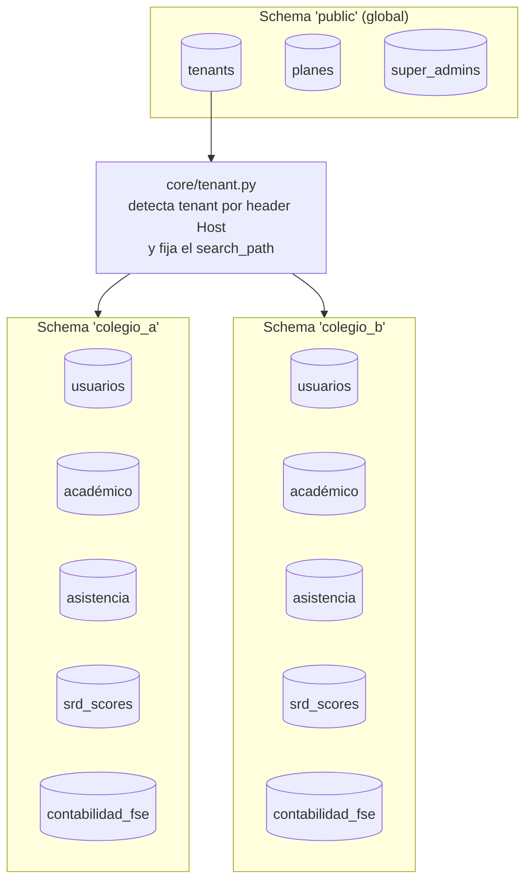
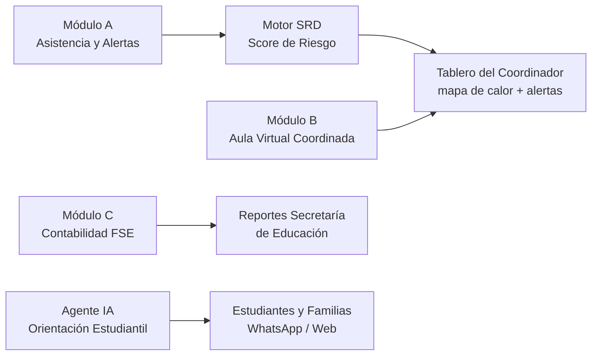
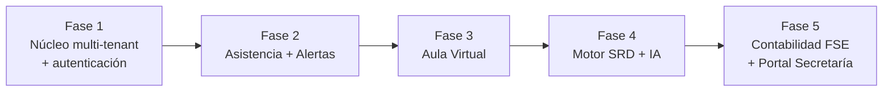

# Arquitectura — GyverLabs

Documento de soporte técnico para el jurado del Concurso Datos al Ecosistema 2026.
Ver [`LICENSE`](../LICENSE) — este material se comparte únicamente con fines de evaluación.

## 1. Modelo multi-tenant

Un servidor sirve N colegios. Cada colegio tiene su propio schema lógico en PostgreSQL,
su propio subdominio y su propia identidad visual, pero comparte el mismo motor de
aplicación y el mismo motor de IA.

## 2. Los cuatro módulos dentro de cada colegio

## 3. Actores y permisos

| Actor | Alcance |
|---|---|
| Super Admin | Gestiona todos los tenants y secretarías desde un panel global |
| Admin Secretaría | Ve agregados departamentales: mapa de riesgo, FSE consolidado, reportes MEN |
| Rector / Coordinador | Panel del colegio: alertas SRD, aprobación de planes, contabilidad FSE |
| Docente | Registra asistencia, sube material del aula virtual, califica |
| Estudiante / Familia | Consulta notas, asistencia, material y habla con el agente IA |

## 4. Fases de construcción

## 5. Qué se protege y por qué

La estructura completa de rutas, modelos y flujos descrita arriba es real y corresponde
a la implementación de producción. Los siguientes componentes se mantienen fuera de este
repositorio público, por ser el activo diferenciador del producto:

- Pipeline de entrenamiento y pesos del modelo LightGBM del SRD
- Reglas de calibración de umbrales por institución
- Lógica exacta de cruce con fuentes de datos abiertas (SISBÉN IV, SIMAT, DANE, SECOP II)
- Prompts y lógica de orquestación del Agente IA de Orientación Estudiantil

Estos componentes están disponibles para revisión ampliada bajo acuerdo de
confidencialidad institucional (MinTIC, Secretarías de Educación, jurado del concurso).
